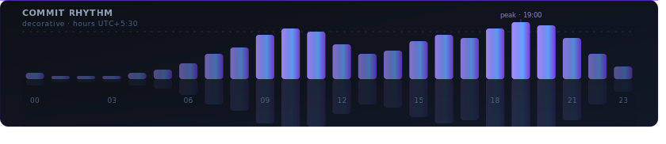

  

  
<h1>👋 Hi, I'm Rupsha Debnath</h1>

<h3> Computer Science (AI & ML) Undergraduate</h3>

Building intelligent systems, exploring data, and continuously learning through projects.

 

 
 

### 👩‍💻 About Me

---

🤖 AI & Machine Learning Enthusiast
 
🔬 Passionate about building practical AI solutions
 
🧠 Interested in Machine Learning, NLP, Computer Vision and Data Science
 
🚀 Always exploring new technologies through projects
 
🏗️ Believe in learning by building

### 🔭 Currently Exploring

---
&nbsp;
&nbsp;
&nbsp;
&nbsp;
&nbsp;
&nbsp;
&nbsp;
&nbsp;

### 💻 Tech Stack

---

#### 🐍 Languages

&nbsp;&nbsp;&nbsp;&nbsp;&nbsp;&nbsp;

#### 🤖 AI / ML Libraries & Techniques

&nbsp;&nbsp;&nbsp;&nbsp;&nbsp;&nbsp;&nbsp;&nbsp;&nbsp;&nbsp;&nbsp;

#### 🌐 Development

&nbsp;&nbsp;

#### 🚀 Deployment & Infrastructure

&nbsp;&nbsp;&nbsp;&nbsp;&nbsp;

  
### 🗂️ Featured Projects

---

<table border="0" cellspacing="20" cellpadding="0" width="100%">
<tr>
<td align="center" width="50%" valign="top">

&nbsp;&nbsp;

**🌩️ Cloud Anomaly Detection System**

ML-powered cloud monitoring platform that detects infrastructure anomalies, analyzes system health metrics, and generates intelligent alerts for proactive incident response.
&nbsp;&nbsp;

&nbsp;
&nbsp;
&nbsp;

  

&nbsp;&nbsp;

  

</td>
<td align="center" width="50%" valign="top">

&nbsp;&nbsp;

**🛡️ AegisNexus-AI**

AegisNexus AI is an AI Governance and Autonomous Threat Containment Platform built for modern agentic systems, LLM security workflows, and cyber-defense simulations.
&nbsp;&nbsp;

&nbsp;
&nbsp;
&nbsp;
&nbsp;

  

&nbsp;&nbsp;

  

</td>
</tr>
<tr>
<td align="center" width="50%" valign="top">

&nbsp;&nbsp;

**🩺 Onco-AI: Cancer Detection & Medical Insight System**

Onco-AI is a Machine Learning based system trained to detect early stage cancer. Currently implemented for breast cancer, with plans to explore other cancer types in future enhancements.
&nbsp;&nbsp;

&nbsp;
&nbsp;
&nbsp;
&nbsp;

  

&nbsp;&nbsp;

  

</td>
<td align="center" width="50%" valign="top">

&nbsp;&nbsp;

**🗳️ Electo : AI Election Assistant**

AI-powered election guide that helps voters understand elections with confidence through smart civic assistance and interactive chat Bot.
&nbsp;&nbsp;

&nbsp;
&nbsp;
&nbsp;
&nbsp;

  

 
 

  

</td>
</tr>
</table>

### 📊 GitHub Stats

---

 

<!-- ─── Profile Details (full width) ─────────────────────────────────────── -->

 

<!-- ─── Language Breakdown ────────────────────────────────────────────────── -->
<table border="0" cellspacing="15" cellpadding="0">
<tr>
<td align="center">

</td>
<td align="center">

</td>
</tr>
</table>

 

<!-- ─── Stats + Streak ────────────────────────────────────────────────────── -->
<table border="0" cellspacing="15" cellpadding="0">
<tr>
<td align="center">

</td>
<td align="center">

</td>
</tr>
</table>

 

  

### 🤝 Connect With Me

---

&nbsp;
&nbsp;
&nbsp;
&nbsp;

 

— Thanks for visiting my profile. —

 

